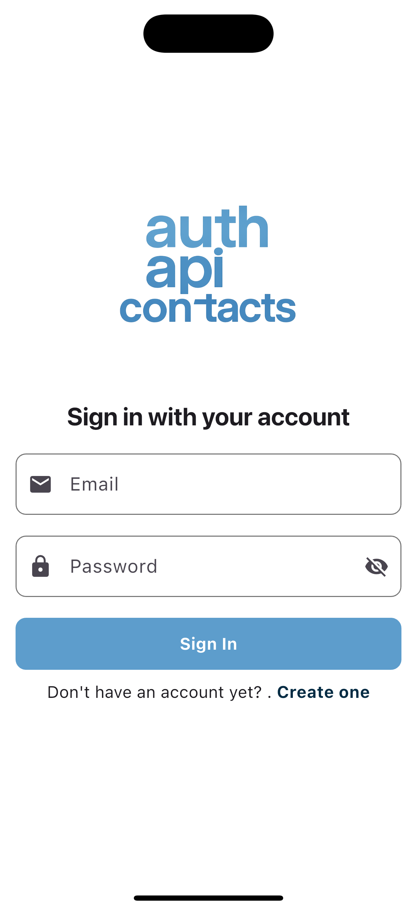
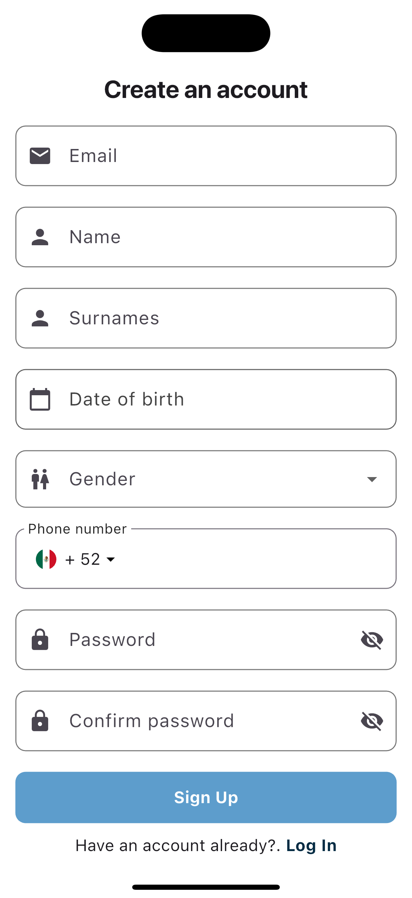
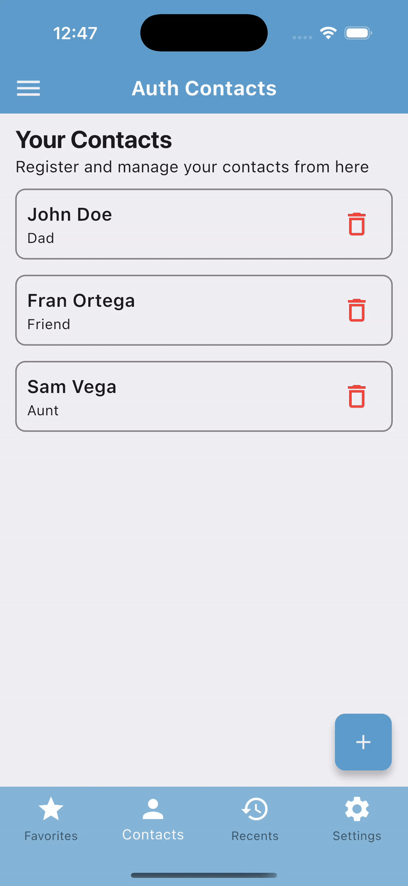
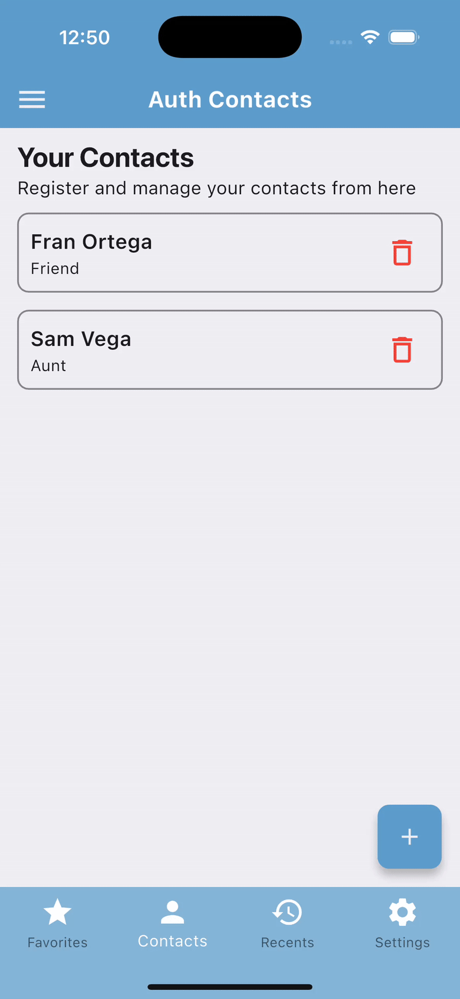

# Auth API APP

A Flutter app showcasing user authentication, profile management and contact handling integrated with a custom backend API. It uses Riverpod for state management and implements clean, reusable UI components with form validation.

The purpose of this app is mainly to show the interaction with the API I created for **user authentication using custom tokens** from Firebase but also shows data management using Firestore Database with a simple contacts page

## Features

1. Authentication via a custom Node.js/Express API using Firebase custom tokens
2. Secure session and data management with ID and refresh tokens
3. Perform CRUD operations with an API
4. Built using Flutter and Dart  

## Screenshots

<p>
  
  
  
  
</p>

## Tech Stack

### 🛠️ Core Technologies

- **[Flutter](https://flutter.dev/)** – UI toolkit for building natively compiled applications across mobile, web, and desktop from a single codebase.
- **[Dart](https://dart.dev/)** – Programming language optimized for building fast, multi-platform apps.

### 📦 Dependencies

- **[`flutter_riverpod`](https://pub.dev/packages/flutter_riverpod)** – State management solution that helps structure and scale Flutter apps with reactive programming.
- **[`cloud_firestore`](https://pub.dev/packages/cloud_firestore)** – Access and manage Firestore, a flexible NoSQL cloud database to store and sync app data in real time.  
- **[`firebase_auth`](https://pub.dev/packages/firebase_auth)** – Provides Firebase Authentication integration for Flutter, including email/password and custom token support.  
- **[`firebase_core`](https://pub.dev/packages/firebase_core)** – Required for initializing and connecting Firebase services with your Flutter app.  
- **[`flutter_secure_storage`](https://pub.dev/packages/flutter_secure_storage)** – A plugin to store sensitive data like tokens securely using Keychain on iOS and Keystore on Android.  
- **[`fluttertoast`](https://pub.dev/packages/fluttertoast)** – Enables toast notifications for showing short feedback messages to users.  
- **[`http`](https://pub.dev/packages/http)** – A powerful HTTP client for making API calls to the custom backend.  
- **[`intl`](https://pub.dev/packages/intl)** – Internationalization and localization support, used for formatting dates, numbers, and strings.  
- **[`phone_input`](https://pub.dev/packages/phone_input)** – A customizable input widget for handling international phone number validation and formatting.

## Getting Started

Follow these steps to run the project locally:

### 1. Clone the repository

```bash
git clone https://github.com/EmilianoAngelJ/auth-api-app.git
cd auth-api-app
```

### 2. Install dependencies

```bash
flutter pub get
```

### 3. Create a Firebase Project

- Go to [Firebase Console](https://console.firebase.google.com/).
- Click **Add project** and follow the setup wizard.

### 4. Enable Firebase Authentication

- In your Firebase project, go to **Authentication > Get Started**.
- Under **Sign-in method**, enable **Email/Password**.

### 5. Set Up Firestore Database

- Go to **Firestore Database > Create database**.
- Choose **Start in test mode** for development purposes.
- Select a Cloud Firestore location and click **Enable**.

### 6. Connect Your Flutter App to Firebase

Run the following command in your terminal at the root of your project:

```bash
flutterfire configure
```

This command will:

- Let you select your Firebase project
- Generate the firebase_options.dart file automatically
- Configure both Android and iOS platforms

⚠️ to use it the [FlutterFire CLI](https://firebase.flutter.dev/docs/cli/) is required – Install it if needed with:

```bash
dart pub global activate flutterfire_cli
```

Make sure the following files were succesfully created as they are necessary:

- firebase_options.dart inside of 'lib/'
- GoogleService-Info.plist inside of 'ios/Runner/'
- google-services.json inside of 'android/app/'


### 7. Configure the backend 

Follow the getting started instructions placed on the README.md file

[Auth API App Backend](https://github.com/EmilianoAngelJ/auth-api-backend.git)

### 8. Run the app

```bash
flutter run
```

## Notes

- This project is for educational and portfolio purposes.
- Connection with a Firebase project and it's configuration is needed.

## License

This project is licensed under the [MIT License](LICENSE).

---

Built using Flutter by [Emiliano Angel](https://github.com/EmilianoAngelJ)
